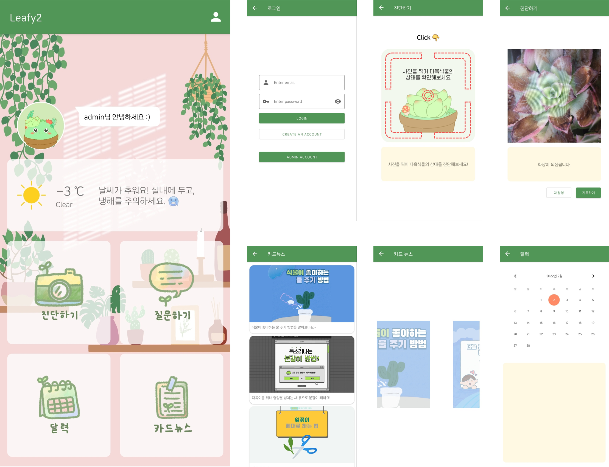

## Project-Leafy2

프로젝트 참여자: 조서연

개발 언어: Kotlin

개발 환경: Android Studio, Firebase

---

#### [졸업프로젝트 Leafy](https://github.com/Leafy-Your-new-buddy/Leafy) 안드로이드(Java) 앱을 Kotlin으로 다시 만들기
목표는 1. Kotlin 익숙해지기, 2. 단순히 기능을 다시 구현하는 것이 아니라, Jetpack components 등 안드로이드 스터디에서 새롭게 배운 내용 적용하기, 3. 제대로 공부하고 이해하기

